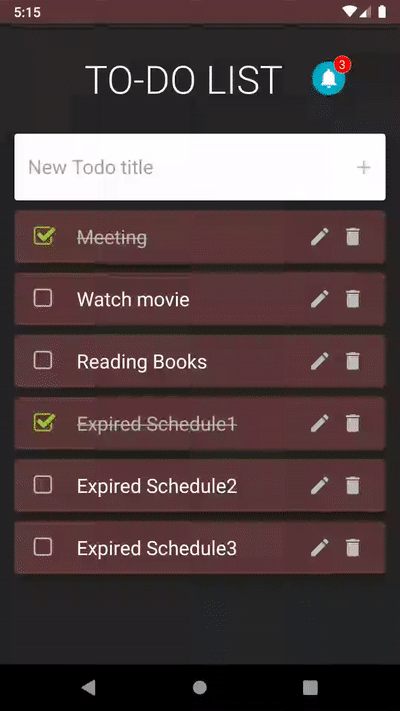
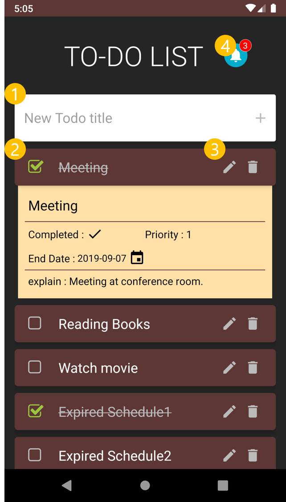
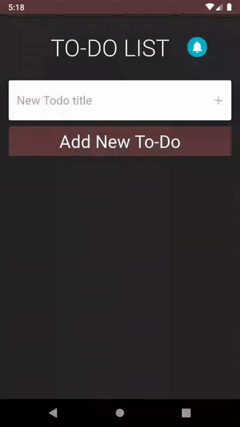
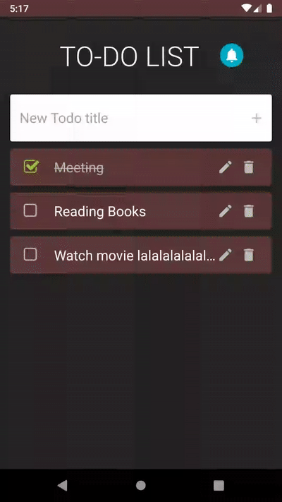
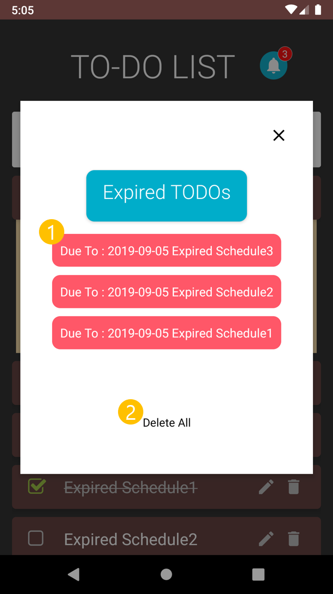
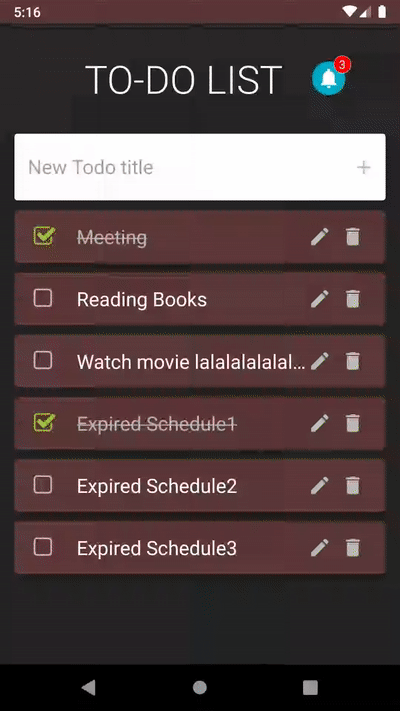
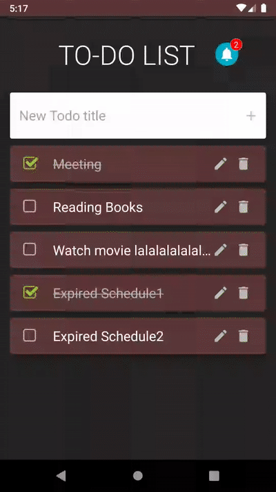

# Preface

This document describes how to use **TO-DO LIST App**

# Main Screen

1. #### Add New Todo 

    You can type todo title and create new todo. If nothing is written on that, title will be "New Todo title" defaultly.

2. #### Todo View

    It shows information of todo, like title, completed state, priority, end date (due date), decription. It orderd by priority and due date.

3. #### Edit and Delete Button

    If press on button that looks like a pencil, change edit mode. Then, you can edit all todo information. The button next to that is the Delete button.

4. #### Expired Todo list Notification

    The number indicate a number of expired todo. If you press button that looks like Alarm Bell, a expired todo list will appear.

# Add todo

You can type new todo's title or leave it blank.

# Edit todo

If you edit to todo, it changes in real time.

# Delete todo

# Check the Expired todos

1. #### Expired Todo list

    It is a list of expired todos. Each elements can be pressed. If you press on this, can delete.

2. #### Clear All

    If you want delete all expired todo, press on!

